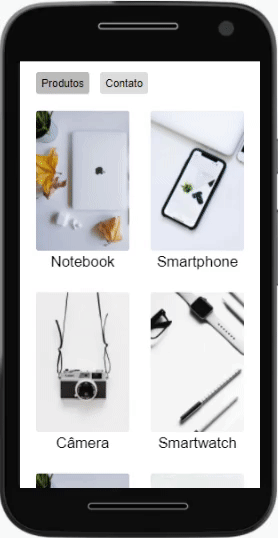

# 💻 CATÁLOGO

---

## 🗒️ Sobre o projeto

Projeto de um catálogo de produtos eletrônicos feito em ReactJS. 
Além dos hooks UseState e UseEffect, foi criado um custom hook chamado "useFetch" 
onde o mesmo retorna uma resposta em json de uma api com os produtos, além de um possível erro e o status do loading 
enquanto se espera a resposta da promise. Foi usado tbm o "react-router-dom' e seu Navlink
para navegação entre os components sem necessidade de refresh, além do "useParams" para
mudança de rota dinâmica de acordo com o produto selecionado. Todo o estilo foi feito em CSS Modules.

---

## 🛠 Tecnologias

### Frontend:

-   HTML
-   CSS
-   JavaScript
-   ReactJS

---

## 🎨 Screens

### Web

  

### Mobile

  

